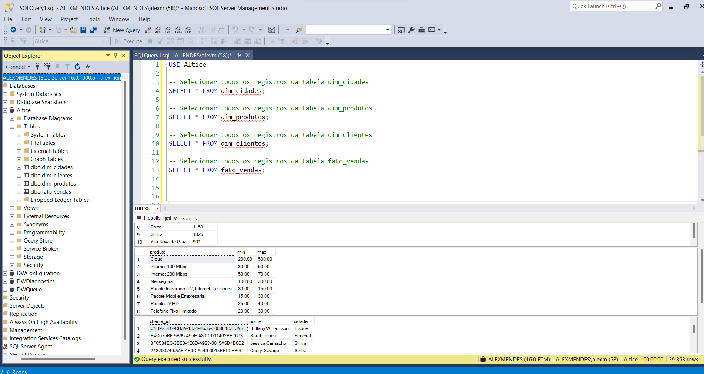
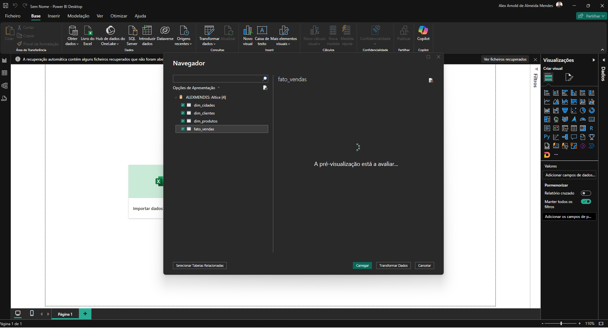

# Data Analyst Project - Altice
**Candidato:** Alex Mendes  
**Vaga:** Data Analyst (ETL, SQL, Power BI)  

## 📌 Visão Geral
Projeto de automação ETL e dashboard para a Altice, desenvolvido como parte do processo seletivo para a vaga de Data Analyst. Inclui:
- **ETL automatizado** com o Python.
- **Dashboard interativo** no Power BI.
- Otimização de consultas SQL e garantia de qualidade dos dados.

## 🛠️ Ferramentas Utilizadas
- **Linguagens:** Python, SQL, DAX
- **Ferramentas:**MS SQL Server, Power BI, pyodbc, pandas
- **Ambiente:** Visual Studio Code, SQL Server Management Studio

## 📂 Estrutura do Projeto
📂 Altice_DataAnalyst_Project/
├── 📂 airflow/
│   ├── 📂 dags/                  # Pasta obrigatória para DAGs
│   │   └── 📄 altice_etl_dag.py  # Seu código de ETL
│   ├── 📂 logs/                  # Logs automáticos do Airflow
│   └── 📄 airflow.cfg            # Arquivo de configuração
├── 📂 data/
│   └── 📄 clientes_altice.csv    # Dados brutos
└── 📂 powerbi/
    └── 📄 Altice_Data.pbix  # Arquivo do Power BI

📌 Visão Geral

Este projeto foi desenvolvido como parte do processo seletivo para a posição de Data Analyst na Altice. O objetivo é demonstrar habilidades em ETL, SQL e Power BI, criando um pipeline de dados automatizado e um dashboard interativo. O projeto inclui:

ETL automatizado com Python, realizando extração, transformação e carga de dados.

Modelagem de dados e otimização de consultas SQL para garantir eficiência e qualidade.

Dashboard interativo no Power BI para visualização e análise dos dados.

🛠️ Ferramentas Utilizadas

Linguagens: Python, SQL, DAX

Banco de Dados: Microsoft SQL Server

Bibliotecas: Pandas, SQLAlchemy, Faker, Seaborn, Matplotlib

ETL & Conectores: PyODBC, Apache Airflow

Ambiente de Desenvolvimento: Visual Studio Code, SQL Server Management Studio (SSMS), Power BI

📂 Estrutura do Projeto

📁 **1. Geração de Dados Sintéticos (dados.py)

Como não havia uma base de dados real disponível, os dados foram gerados utilizando a biblioteca Faker. O script gera informações sobre clientes, cidades, produtos e vendas, salvando os resultados em arquivos CSV.

Geração de clientes fictícios por cidade.

Atribuição de produtos vendidos e valores de preços aleatórios.

Registro de vendas com datas variadas entre 2022 e 2025.

📊 **2. Análise Exploratória dos Dados (eda.ipynb)

Foi realizada uma análise exploratória detalhada dos dados gerados para verificar sua consistência e identificar padrões. Foram utilizadas as bibliotecas Pandas, Seaborn e Matplotlib para:

Verificar a estrutura e qualidade dos dados.

Analisar a distribuição de clientes por cidade.

Analisar a distribuição de vendas por produto.

Visualizar o volume de vendas ao longo do tempo.

Avaliar os preços dos produtos por meio de boxplots.

🛢️ **3. Conexão com Banco de Dados (SQL_conexao.ipynb)

A conexão com o Microsoft SQL Server foi estabelecida utilizando pyodbc. O notebook verifica a conexão e retorna a versão do SQL Server para garantir que o ambiente está devidamente configurado.

🔄 **4. Pipeline ETL Automatizado (ETL.py)

O processo de ETL (Extract, Transform, Load) foi implementado para carregar os dados gerados no SQL Server. Ele segue os seguintes passos:

Extração: Carregamento dos arquivos CSV.

Transformação: Ajuste das colunas e conversão de tipos de dados.

Carga: Inserção dos dados no banco de dados SQL Server via SQLAlchemy.

Otimização: Implementação de chaves primárias e estrangeiras para normalização.

📊 **5. Dashboard no Power AlticeDat.pbix)

🚀 Como Executar o Projeto

Instalar as dependências:

Gerar os dados sintéticos:

python dados.py

Executar a análise exploratória:

Abrir eda.ipynb e rodar todas as células.

Configurar a conexão com o banco de dados:

Verificar as credenciais em SQL_conexao.ipynb.

Executar o pipeline ETL:

📌 Conclusão

Este projeto demonstra a capacidade de trabalhar com ETL, SQL e Power BI, criando um pipeline automatizado de dados para análise e visualização. Ele foi estruturado para garantir escalabilidade, eficiência e qualidade na manipulação dos dados, atendendo aos requisitos da vaga de Data Analyst na Altice.

## Tabelas criadas no SQL server e conectadas com o python 

## Power BI conexão com SQL Server e Dashboard

